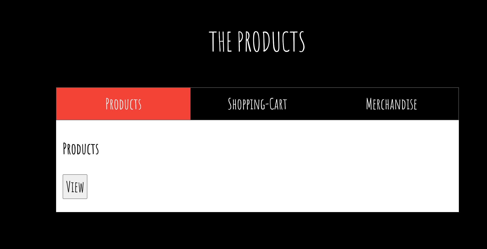
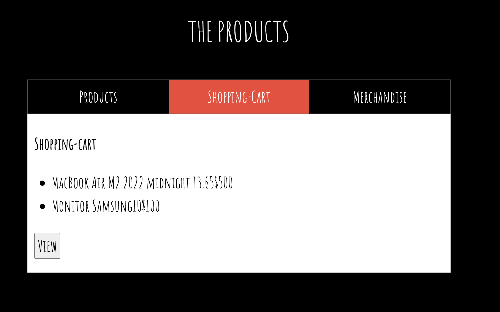

## Despliegue de Aplicaciones 

La empresa ZERO Technology ha lanzado un nuevo proyecto que requiere la implementación de múltiples aplicaciones en un servidor. El objetivo es desplegar tanto el frontend como varios servicios backend utilizando PM2 para gestionar los procesos. Este desafío está diseñado para evaluar tus habilidades en el despliegue de aplicaciones, la configuración del entorno y la automatización.


## **Requerimiento:**

**ZERO Technology** ha solicitado al Equipo de DevOps el despliegue de la siguiente solución en un servidor EKS para la gestión de procesos:

### Servicios a Desplegar:
**Frontend**
- Descripción: Aplicación web realizada en Express.
- Puerto: 3000

**Backend Products**
- Descripción: Servicio backend para productos realizado en Express.
- Puerto: 3001

**Backend Shopping-Cart**
- Descripción: Servicio backend para carrito de compras realizado en Express.
- Puerto: 3002

**Backend Merchandise**
- Descripción: Servicio backend para mercancías realizado en Express.
- Puerto: 3003

### **Instrucciones**


3. **Configuración de Aplicaciones:**
   - repositorio 
   
   - Aplicaciones en ms
   ```bash
    ├── frontend
    │   ├── index.html
    │   ├── package-lock.json
    │   ├── package.json
    │   └── server.js
    ├── merchandise
    │   ├── package-lock.json
    │   ├── package.json
    │   └── server.js
    ├── products
    │   ├── package-lock.json
    │   ├── package.json
    │   └── server.js
    └── shopping-cart
        ├── package-lock.json
        ├── package.json
        └── server.js
   ```
   - Navega al directorio de cada aplicación y realiza la instalación de dependencias:
     ```bash
     npm install
     ```

4. **Despliegue de Aplicaciones:**
   Implementación:

      Inicializa Terraform: terraform init
      Aplica la configuración: terraform apply
      Una vez que el cluster EKS esté listo, configura kubectl: aws eks --region us-west-2 update-kubeconfig --name my-cluster
      Despliega la aplicación: kubectl apply -f k8s/

### **Resultado Esperado:**







